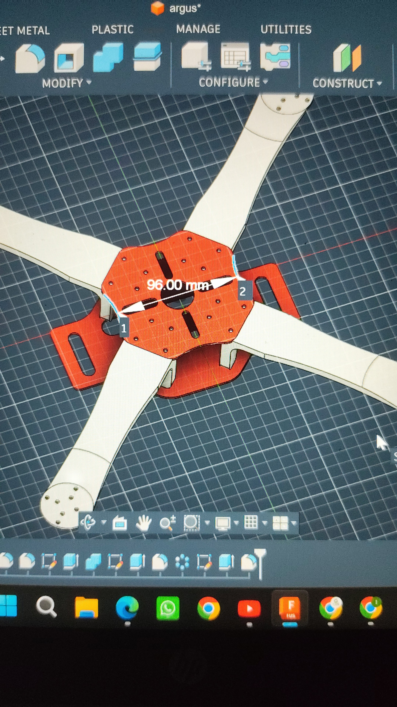
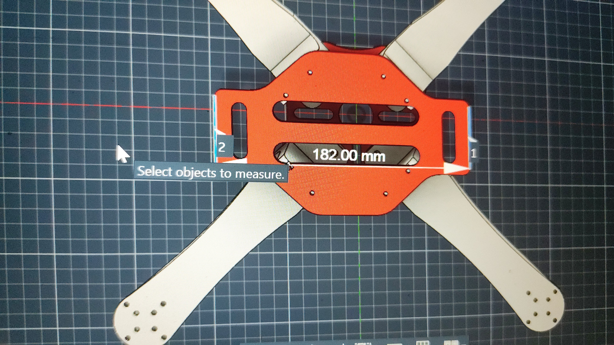
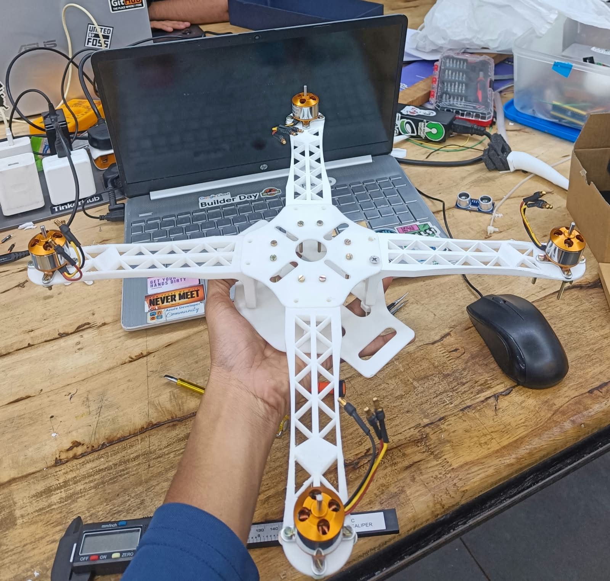
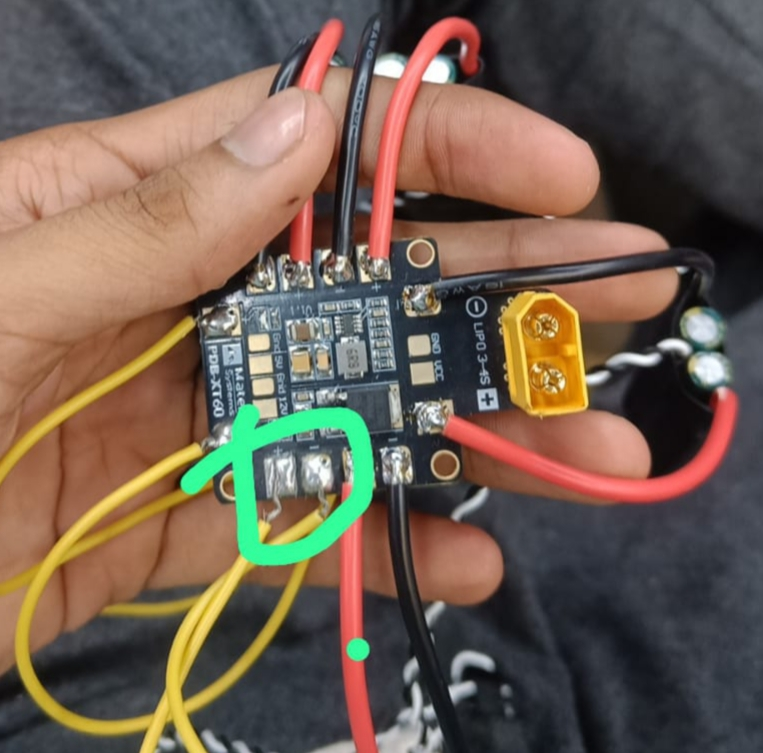
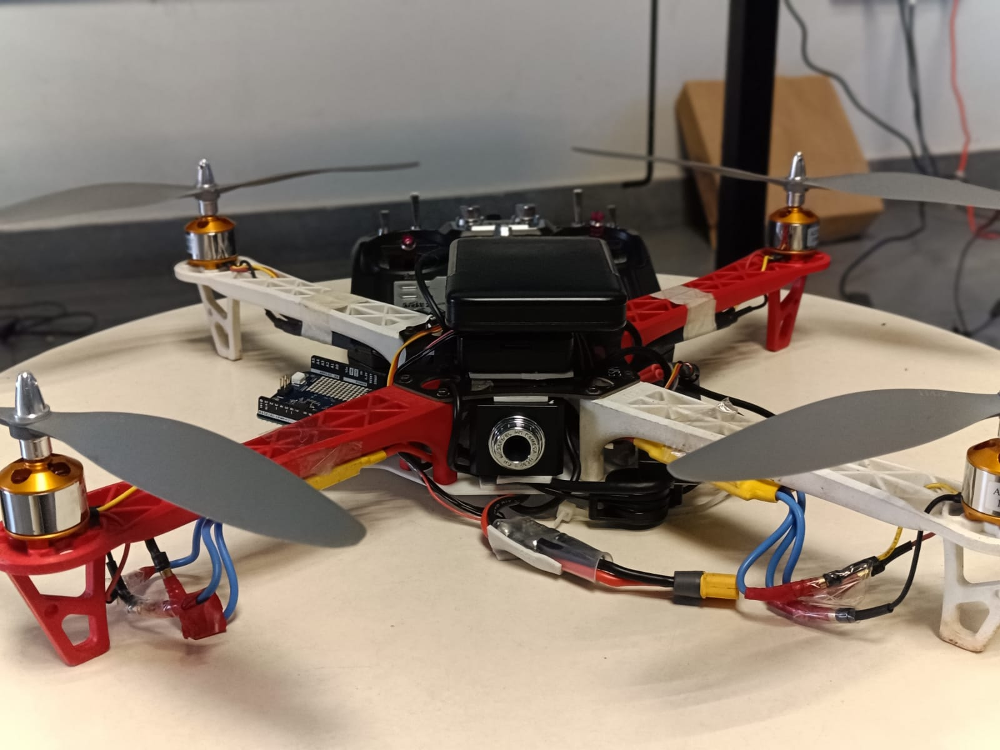

# ARGUS — Building a Vision-Based Drone, One Week at a Time

ARGUS began as a proof of concept for a camera drone that could handle its computer-vision tasks onboard: person detection, tracking, hand-gesture control, and the logic needed to follow a selected person.

The core idea was to build around the **Arduino UNO Q**, rather than rely on a Raspberry Pi or another separate single-board computer for the vision workload. The UNO Q combines a Qualcomm processor for higher-level computing with an STM32 microcontroller for real-time control tasks. We wanted to explore whether this combination could let the drone handle its camera and computer-vision work while reducing the need for extra computing hardware and a separate external MCU.

That matters on a drone. Every additional board draws power, adds weight, and brings its own heat and integration overhead. If the vision and control-related tasks can be handled efficiently on the UNO Q, the goal is to reduce overall power demand, computational overhead, and heat — potentially leaving more of the battery available for flight and improving flight time. These are the motivations behind the proof of concept, not performance gains we assume without testing.

The project did not start with everything running on the UNO Q. We first used a Raspberry Pi to get the camera and vision pipeline working, then explored moving that work to the UNO Q while developing the frame and flight hardware. This README follows that process, including what worked, what gave us trouble, and where the project stands now.

This README is the story of that process — what we tried, what worked, what gave us trouble, and where the project stands now.

> **A note on the current state:** ARGUS has a working computer-vision prototype and the broader hardware project has reached a documented first flight. The Python code in this repository generates high-level flight intents; it does **not** directly control motors or send flight commands to Pixhawk.

[](https://www.raspberrypi.com/products/raspberry-pi-5/)
[](https://github.com/ultralytics/ultralytics)
[](https://onnxruntime.ai/)
[](https://pixhawk.org/)
[](https://px4.io/)
[](https://www.python.org/)

---

<!-- PROJECT VIDEO: Replace ADD_PROJECT_VIDEO_URL with the actual YouTube/video URL. -->
> 🎥 **Watch the ARGUS project demo:** []

## Table of Contents

- [The Idea: A Drone That Can See and Follow](#the-idea-a-drone-that-can-see-and-follow)
- [The First Big Decision: Where Should the Vision Run?](#the-first-big-decision-where-should-the-vision-run)
- [Main Components Used](#main-components-used)
- [Development Journal](#development-journal)
  - [Week 0 — Turning the Idea into a Plan](#week-0--turning-the-idea-into-a-plan)
  - [Week 1 — Getting the Camera to See People](#week-1--getting-the-camera-to-see-people)
  - [Week 2 — Refining the Model and Starting the Physical Design](#week-2--refining-the-model-and-starting-the-physical-design)
  - [Week 3 — Testing the Pi Setup and Printing a First Part](#week-3--testing-the-pi-setup-and-printing-a-first-part)
  - [Week 4 — The Frame, Printing Problems, and Drone Physics](#week-4--the-frame-printing-problems-and-drone-physics)
  - [Week 5 — Taking Stock of the Project](#week-5--taking-stock-of-the-project)
  - [Week 6 — Choosing a Practical Frame and Moving Towards UNO Q](#week-6--choosing-a-practical-frame-and-moving-towards-uno-q)
  - [Week 7 — Getting Computer Vision Running on UNO Q](#week-7--getting-computer-vision-running-on-uno-q)
  - [Week 8 — Assembly, Wiring, and a Failed PDB](#week-8--assembly-wiring-and-a-failed-pdb)
  - [Week 9 — Pixhawk Setup and the First Flight](#week-9--pixhawk-setup-and-the-first-flight)
  - [Week 10 — External Camera Mounting](#week-10--external-camera-mounting)
- [What the Vision Software Does](#what-the-vision-software-does)
  - [From a Camera Frame to a Detection](#from-a-camera-frame-to-a-detection)
  - [Keeping Track of a Person Across Frames](#keeping-track-of-a-person-across-frames)
  - [Using Hand Gestures as Commands](#using-hand-gestures-as-commands)
  - [Turning Target Position into a Movement Intent](#turning-target-position-into-a-movement-intent)
  - [Configuration Lives in One Place](#configuration-lives-in-one-place)
- [Requirements and Installation](#requirements)
  - [Install the Project](#install-the-project)
  - [Start the Vision Pipeline](#start-the-vision-pipeline)
  - [Run the Raspberry Pi Smoke Test](#run-the-raspberry-pi-smoke-test)
- [A Closer Look at the Build](#a-closer-look-at-the-build)
- [What Works, and What Is Still Missing?](#what-works-and-what-is-still-missing)
- [Where ARGUS Can Go Next](#where-argus-can-go-next)
- [Repository Layout](#repository-layout)
- [A Few Design Choices Worth Explaining](#a-few-design-choices-worth-explaining)
- [Weekly Development Notes](#weekly-development-notes)
- [License](#license)

---

## The idea: a drone that can see and follow

The proof of concept is about more than detecting a person. The aim is to put the camera, computer vision, and gesture-driven behaviour on the drone using the UNO Q's Qualcomm processor and STM32 microcontroller together. The hoped-for benefit is a more integrated onboard system, without needing a separate companion computer and an additional external MCU for the intended tasks.

There were a few things we wanted to get right:

- Detect people in the camera feed.
- Give each detected person a tracking ID and keep that ID consistent across frames where possible.
- Select one person as the target instead of switching between people unexpectedly.
- Recognise a small set of hand gestures.
- Convert the target's position in the image into limited movement intents.
- Keep the vision code separate from the actual flight-control system.
- Bring the companion computer and Pixhawk-based drone together as the project developed.

We treated this as a development project rather than assuming the whole system would work from day one. The vision pipeline, mechanical design, companion computer, and flight controller could each be tested separately before trying to combine them.

## The first big decision: where should the vision run?

The original direction was to use the Arduino UNO Q as the main onboard computing platform. Its Qualcomm processor provides the computing side, while its STM32 microcontroller can handle real-time microcontroller tasks. Our hypothesis was that using this combination for the drone's vision and control-related workload could reduce the power, weight, heat, and integration overhead associated with using a separate Raspberry Pi-class computer plus an additional MCU.

We started on the Raspberry Pi because it gave us a practical way to get the camera and person-detection pipeline working. That early implementation was a stepping stone: it let us develop and test the vision software before adapting it for the UNO Q. The project notes document that move, as well as the later hardware integration.

The software checked into this repository still includes the Raspberry Pi-oriented Python vision pipeline, using a Raspberry Pi camera, YOLOv8n, and ONNX Runtime. The broader project records also document the UNO Q implementation. The potential reduction in power use, heat, and flight-time impact is the central idea being explored; it should be measured on the assembled system rather than treated as an already-proven result.

---

## Main Components Used

The exact components changed as the project developed. This table covers the main hardware mentioned in the build notes; add exact model numbers where you want to document them.

| Component | Purpose in ARGUS | Notes |
|---|---|---|
| Arduino UNO Q | Intended onboard computing platform for the proof of concept | Qualcomm processor for higher-level computing and STM32 microcontroller for MCU-level tasks |
| USB webcam | Camera used for the Week 10 onboard-camera test | Temporary solution while a directly interfaced camera module is being considered |
| USB hub | Connects the webcam to the UNO Q | Powered separately during the Week 10 test |
| External power bank | Supplies power to the USB hub | Temporary arrangement for the camera test |
| Raspberry Pi 5 | Initial platform used to develop the computer-vision pipeline | Used during early camera and vision development |
| Raspberry Pi Camera | Camera used during early vision development | Part of the initial Raspberry Pi setup |
| Pixhawk flight controller | Flight stabilisation and autopilot hardware | Configured using QGroundControl and PX4 during flight preparation |
| Power Distribution Board (PDB) | Distributes power to drone electronics | Replaced during development after a power-up failure |
| Capacitor for the PDB | Part of the corrected power-distribution setup | Confirm the exact component/value from the hardware notes before documenting it |
| ESCs | Drive the motors according to flight-controller outputs | Connections were checked and corrected during setup |
| Brushless motors and propellers | Provide drone thrust | Used for the physical drone and flight tests |
| Drone frame and mounting hardware | Supports the electronics and propulsion system | Frame selection and 3D-printed component prototypes were part of development |
| Battery | Supplies flight power | Record the exact battery specification from the hardware label when available |

---

## Development journal

## Week 0 — Turning the idea into a plan

Before building anything, we broke the idea down into a few parts: person detection, target tracking, gesture-based actions, autonomous pursuit, and Pixhawk-based flight control.

We also compared the Raspberry Pi and Arduino UNO Q for their computing capability, camera support, power requirements, real-time behaviour, and software ecosystem.

One decision we made early was to keep the first flight experiments controlled. A vision system that detects a person is not automatically a flight-ready system, so the initial plan treated tethered or controlled testing as an important step before attempting more autonomous behaviour.

The project would need to bring together two different kinds of work: software that interprets what the camera sees, and hardware that can actually fly.

## Week 1 — Getting the camera to see people

The first practical milestone was getting the Raspberry Pi vision setup running. We worked on camera configuration, live video acquisition, the required computer-vision dependencies, initial person detection, tracking IDs, and frame-rate monitoring. This also laid the groundwork for adding hand-gesture recognition.

Seeing multiple people detected in the camera feed, each with a bounding box and tracking ID, was an important early result. It meant the project had moved beyond the idea stage and into a working vision prototype.


*The first person-detection and tracking tests on the Raspberry Pi.*

At this stage, the focus was on making the vision pipeline work reliably enough to build on. Flight control was still a separate task.

## Week 2 — Refining the model and starting the physical design

Once the vision model was running, we continued refining the Raspberry Pi implementation. At the same time, the mechanical side of the project started taking shape.

<!-- WEEK 2 PHOTO 1: Replace the placeholder filename with the actual image path. -->


We began planning the drone components, dimensions, mounting points, and how the parts would fit together. The design had to account for more than appearance: the frame needed to hold the electronics and flight hardware without adding unnecessary weight or creating assembly problems.

<!-- WEEK 2 PHOTO 2: Replace the placeholder filename with the actual image path. -->


This was the beginning of the project becoming a physical build rather than just a computer-vision demo.

## Week 3 — Testing the Pi setup and printing a first part

The Raspberry Pi implementation reached a working stage for the computer-vision system, while mechanical development moved towards physical testing.

We printed a drone leg as an initial prototype. It gave us a part we could inspect and evaluate for strength before committing to the rest of the structure.

That first print was only one step, but it helped turn the design into something we could test in our hands. The next challenge was improving the overall design and figuring out which materials would work for the intended frame.

<!-- WEEK 3 VIDEO: Replace ADD_WEEK_3_VIDEO_URL with the actual video URL. -->
> 🎥 **Week 3 — first 3D-printed part:**[Watch video](

https://github.com/user-attachments/assets/8d8be39d-6964-490f-861d-9866ee75ea14

)

## Week 4 — The frame, printing problems, and drone physics

We continued refining the 3D-printed drone design and started thinking more carefully about the forces involved. Thrust, lift, total weight, and the forces acting on the frame all mattered when deciding what to print and how the structure should be built.

The printing process did not go entirely to plan. PLA became temporarily unavailable, and an alternative filament caused printing problems that meant the printer needed cleaning before work could continue.

<!-- WEEK 4 PHOTO: Replace the placeholder filename with the actual image path. -->


*The mechanical side of ARGUS developed alongside the software.*

We also considered carbon-fibre-infused PETG for parts that needed more strength. Material availability and suitable screws and fasteners affected the assembly plan, so we had to adapt instead of following the original design exactly.

## Week 5 — Taking stock of the project

This week was about reviewing the work so far and making sure the ongoing development had a clear picture of the project's state.

The handoff covered the computer-vision work, 3D design, printing, drone physics, what had already been completed, and what still needed attention. It was a useful point to bring the different parts of the project back together and identify the next steps.

## Week 6 — Choosing a practical frame and moving towards UNO Q

The frame decision was affected by the materials we could actually get. The planned carbon-fibre-infused PETG approach was limited by availability, while PLA did not give us the confidence in strength that we wanted for the intended application.

<!-- WEEK 6 PHOTO: Replace the placeholder filename with the actual image path. -->


Rather than letting the mechanical work stall, we chose a strong frame that was already available.

At the same time, we started work on the Arduino UNO Q implementation. This was the key step towards the original proof-of-concept idea: use the UNO Q's Qualcomm processor for the higher-level vision workload and its STM32 microcontroller for MCU-level tasks, instead of building the system around a Raspberry Pi-class computer plus a separate external MCU. The hoped-for payoff was lower overall power demand and heat, less computing overhead, and the possibility of gaining flight time. Those benefits still need to be validated with measurements on the complete drone.

The project was no longer just about getting the vision system working on the Raspberry Pi; we were exploring how that work could fit into the intended integrated hardware setup.

## Week 7 — Getting computer vision running on UNO Q

The UNO Q needed troubleshooting and reset procedures before development could continue smoothly. We adapted the Raspberry Pi vision code towards UNO Q compatibility, using AI-assisted code conversion followed by corrections and testing.

The documented work reached a stage where computer vision was implemented on the UNO Q.


*Computer-vision implementation on the Arduino UNO Q.*

Moving code between platforms was not simply a matter of copying files. Hardware interfaces and software dependencies had to be accounted for, and the converted implementation needed to be checked rather than assumed to be correct.

## Week 8 — Assembly, wiring, and a failed PDB

With the UNO Q implementation progressing, we moved further into hardware assembly. Major electronic components were positioned and soldered as part of integrating the computing hardware with the drone.

During power-up testing, the power distribution board (PDB) failed. The issue documented at the time was that a required capacitor had not been included. We replaced the PDB, added a suitable capacitor, and completed the power-system connections.

<!-- WEEK 8 PHOTO: Replace the placeholder filename with the actual image path. -->



*Hardware assembly and component integration.*

This was a reminder that a working software system and a physically assembled drone are two very different milestones. Power distribution, wiring, mounting, and the small details around them all need to be checked before moving on.

## Week 9 — Pixhawk setup and the first flight

The last documented stage focused on getting the flight controller configured and preparing the drone for flight. We worked through Pixhawk configuration, PX4 firmware flashing, QGroundControl calibration, and checking the ESC connections.

The first step was manual calibration in **QGroundControl (QGC)**. We followed the calibration process in the software and checked that the flight controller could detect the required sensors and complete the setup steps.

<!-- WEEK 9 VIDEO 1: Replace ADD_QGC_CALIBRATION_VIDEO_URL with the actual video URL. -->
> 🎥 **Week 9 — QGroundControl calibration:** [Watch video](

https://github.com/user-attachments/assets/80f877c4-87bd-496a-a729-3533ae22f998

)

After that, we checked the ESC calibration and tested the motors individually to make sure each motor responded correctly to the expected output. During this stage, we found incorrect ESC connections and corrected them before continuing.

<!-- WEEK 9 VIDEO 2: Replace ADD_ESC_MOTOR_TEST_VIDEO_URL with the actual video URL. -->
> 🎥 **Week 9 — ESC calibration and individual motor testing:** [Watch video](

https://github.com/user-attachments/assets/969b4cbf-2a42-4c6a-8200-fe3666946242

)

During the pre-flight checks, QGroundControl also displayed warnings, including a low-battery warning, a no-GPS warning, and a warning that no physical safety switch was detected. These messages were part of the setup and readiness checks, and they should be understood in the context of the configuration used for that test. A warning should not be ignored simply to get airborne; before future flights, the required battery, GPS, and safety-switch configuration should be checked against the flight mode and hardware being used.

The project also included experiments with ArduPilot and Mission Planner. That calibration attempt did not succeed, so we returned to the PX4 and QGroundControl setup for further configuration and calibration.


*The first-flight milestone documented during development.*

After working through the configuration and connection issues, the drone completed its first flight. That was a major milestone for the physical build. It is important, though, to distinguish that milestone from the current Python vision code: the checked-in code generates flight intents and is not itself a complete autonomous flight-control stack.

<!-- WEEK 9 VIDEO 3: Replace ADD_FIRST_FLIGHT_VIDEO_URL with the actual video URL. -->
> 🎥 **Week 9 — first flight:** [Watch video](ADD_FIRST_FLIGHT_VIDEO_URL)

---

## Week 10 — Mounting an external camera on the drone

This week, I mounted the camera externally on the drone so I could test the physical setup without waiting for a dedicated camera module. I used a USB webcam connected to the Arduino UNO Q through a USB hub. The hub was powered separately by an external power bank.

This was a practical workaround because time was limited. It let me get the camera physically mounted and connected to the UNO Q using hardware that was already available, rather than delaying the build while sourcing and integrating a camera module.

<!-- WEEK 10 PHOTO PLACEHOLDER: Add the actual image file to docs/pics1/ and update the filename below. -->


*Placeholder: external webcam mounted on the drone, connected to the UNO Q through a USB hub powered by an external power bank.*

<!-- WEEK 10 VIDEO: Replace ADD_WEEK_10_CAMERA_FLIGHT_VIDEO_URL with the actual video URL. -->
> 🎥 **Week 10 — flight test with the camera onboard:** [Watch video](ADD_WEEK_10_CAMERA_FLIGHT_VIDEO_URL)

We also carried out flight testing with the camera mounted on the drone. This let us check the physical camera mounting and see how the added webcam, USB hub, and separate power bank fit into the flight setup. The arrangement is still a temporary proof-of-concept setup, rather than the final lightweight integrated solution.

The setup is useful for the current proof of concept, but it is not the final camera and power arrangement. The external hub and power bank add extra hardware, weight, and cabling — exactly the sort of complexity the integrated UNO Q approach is intended to reduce.

---

# What the vision software does

The hardware work is one side of ARGUS. The other is the Python vision pipeline, which takes camera frames, detects people, tracks them, interprets gestures, and produces a high-level movement intent.

The software is organised into small modules so that the parts can be developed and tested independently.

```text
Camera / Video
      |
      v
Preprocessing
      |
      v
YOLOv8n ONNX inference
      |
      v
Detection post-processing
      |
      v
Person tracker
      |
      +--------------------+
      |                    |
      v                    v
Gesture recognition   Follow controller
      |                    |
      +---------+----------+
                |
                v
          Flight intent
                |
                v
       Future autopilot interface
```

The key boundary is at the end: the Python pipeline produces a high-level intent. The autopilot interface and actual motor control are separate integration tasks.

## From a camera frame to a detection

The current software includes the following model files:

```text
code/models/yolov8n.onnx
code/models/yolov8n.pt
```

The runtime pipeline uses the ONNX model through **ONNX Runtime**, with the CPU execution provider. The detector loads the model, reads its input shape, configures runtime threading and graph optimisation, receives a preprocessed image tensor, and returns the raw model output.

The post-processing code then filters for the person class and converts the model's bounding-box values into coordinates that can be used with the original camera frame.

### Preparing the image

The camera configuration currently uses a resolution of `640 × 480`, while the bundled YOLOv8n model is expected to use a `640 × 640` input.

To prepare the frame, the preprocessing module:

1. Keeps the original aspect ratio while resizing the image.
2. Adds padding to fit the model input size.
3. Normalises pixel values from `0–255` to `0–1`.
4. Changes the image layout from HWC to CHW.
5. Adds the batch dimension expected by the model.

The preprocessing code stores the scale and padding values too. Those values are needed later to map detections back to the original camera coordinates.

```text
Original frame
      |
      v
Keep aspect ratio
      |
      v
Resize to model input
      |
      v
Add padding
      |
      v
Normalise pixel values
      |
      v
HWC -> CHW -> batch dimension
```

### Reading the model output

The post-processing module supports two related output layouts.

For detection output, the code interprets the values as bounding-box coordinates and class scores:

```text
x
y
width
height
class scores...
```

Only the person class is retained. Confidence filtering and IoU-based non-maximum suppression (NMS) are used to remove low-confidence and overlapping detections. The configured IoU threshold is `0.45`.

The code also supports a pose output row containing 56 values:

```text
4 bounding-box values
+ 1 person confidence
+ 17 x/y/keypoint-confidence triplets
```

Those 17 COCO pose keypoints provide the information used by the gesture-recognition module.

## Keeping track of a person across frames

Detection tells us where people are in an individual frame. Tracking is what helps the system associate those detections across multiple frames.

ARGUS uses a lightweight tracker rather than depending on a large external tracking framework. It associates detections with existing tracks using bounding-box IoU, normalised centre-point distance, detection-to-track matching, and a tolerance for missed frames.

Each person receives a session-local ID. For example:

```text
Person A -> ID 1
Person B -> ID 2
Person C -> ID 3
```

These IDs are local to the current tracking session; they are not permanent identities.

The main tracking settings are:

```yaml
tracking:
  max_missed: 12
  min_hits: 2
  iou_threshold: 0.20
  max_center_distance: 0.18
```

A track becomes confirmed after the configured number of successful hits. If a person is briefly hidden or missed by the detector, the track can remain alive for a limited number of frames instead of being discarded immediately.

## Using hand gestures as commands

Once pose keypoints are available, the gesture module looks at the positions of the wrists in relation to the shoulders. It mainly uses these points:

```text
Nose
Left Shoulder
Right Shoulder
Left Wrist
Right Wrist
```

The current gesture-to-intent mapping is:

| Gesture | Intent |
|---|---|
| Right hand up | `start_follow` |
| Left hand up | `stop_follow` |
| Both hands up | `land` |

A single noisy frame should not be enough to trigger an action. To reduce accidental triggers, the recogniser uses a keypoint-confidence threshold, a hold-frame requirement, per-track gesture state, a cooldown, and track-specific gesture events.

The current settings are:

```yaml
gestures:
  hold_frames: 4
  cooldown_seconds: 2.0
  keypoint_threshold: 0.35
```

This also helps keep gesture events associated with the tracked person who made them.

## Turning target position into a movement intent

The follow controller uses the selected person's position and apparent size in the camera image to generate bounded movement intents. It does not directly control motors.

The output has this general form:

```json
{
  "yaw": 0.0,
  "forward": 0.0,
  "vertical": 0.0,
  "action": "follow",
  "target_id": 1,
  "reason": "target locked"
}
```

The controller considers three main things:

- **Horizontal error:** how far the target's centre is from the centre of the frame. This is converted into a bounded yaw intent.
- **Vertical error:** how far the target is above or below the frame centre. This is converted into a bounded vertical intent.
- **Apparent target size:** the target's bounding-box area is compared with a desired area ratio and used as a simple distance proxy. A target that appears too small can produce a forward intent; a target near the desired size can produce a hold; and a target that appears too large can reduce forward movement.

The current controller limits are:

```yaml
controller:
  target_area_ratio: 0.18
  deadband_x: 0.08
  deadband_y: 0.10
  max_yaw: 0.35
  max_forward: 0.30
  max_vertical: 0.25
  target_timeout_seconds: 0.75
```

These values bound the generated intents. They should not be read as direct motor speeds or as a guarantee that a real drone will behave safely under every condition.

## What happens when the target disappears?

A follow system needs to handle more than the ideal case where the target stays visible.

ARGUS uses conservative behaviour in the intent-generation layer:

- If no target is selected, following stays disabled and the controller produces a hover intent.
- If the target is temporarily missing, the system does not immediately switch to a different person.
- If the selected target remains unavailable beyond the configured timeout, the controller produces a safe hover intent.
- Once a target is selected, another tracked person's gestures should not silently take over the control session.
- A `both_hands_up` gesture can produce `action = "land"` when it belongs to the currently permitted target.

The current Python code outputs high-level flight-intent JSON. It does not send PWM signals, control ESCs, transmit direct MAVLink commands, or directly command Pixhawk. That boundary is deliberate: the vision prototype can be tested separately from the autopilot.

---

# The camera and inference setup

The camera abstraction supports two backends.

For a Raspberry Pi camera, the default configuration is:

```yaml
camera:
  backend: picamera2
```

For an OpenCV camera or a video file, the backend can be changed to:

```yaml
camera:
  backend: opencv
```

The OpenCV path converts BGR frames to RGB before sending them into the model pipeline. This allows local development and video-file testing without requiring the Raspberry Pi camera stack.

The current inference settings are:

```yaml
model:
  path: models/yolov8n.onnx
  confidence: 0.45
  iou_threshold: 0.45
  threads: 4
  inference_stride: 2
```

The ONNX model runs with `CPUExecutionProvider`, with the number of intra-operation threads configurable. An inference stride of `2` means the model runs on every second frame rather than every frame. This reduces the computational load and can be useful on resource-constrained hardware.

## Configuration lives in one place

The main runtime settings are stored in:

```text
code/configs/config.yaml
```

The configuration covers the model path and thresholds, CPU thread count, inference stride, camera backend and resolution, tracking parameters, gesture thresholds and mappings, and controller limits and timeout.

The Python configuration layer uses dataclasses and validates important values before the application starts.

---

# The hardware side

The physical build developed alongside the software. The main hardware elements documented during development were:

- Raspberry Pi computer-vision platform and Raspberry Pi camera.
- Arduino UNO Q experimentation and integration.
- Pixhawk flight controller.
- ESCs and motors.
- Power Distribution Board (PDB).
- Drone frame and 3D-printed components.
- Structural prototypes, mounting hardware, and suitable fasteners.

The mechanical work included designing parts around the frame requirements, printing prototypes, evaluating strength, refining the design, and integrating the parts. Material availability and fasteners affected the original plan, so the final approach changed as the build progressed.

The flight-control work involved Pixhawk configuration, PX4 firmware, QGroundControl, ESC connection checks, and experiments with ArduPilot and Mission Planner. The documented path that continued successfully was PX4 with QGroundControl.

---

# Running the vision code

The following instructions are for the Python software in `code/`. They do not set up the full drone hardware or connect the vision pipeline to Pixhawk.

## Requirements

The current Python project requires:

- Python `>= 3.11`
- NumPy `>= 1.26, < 3`
- ONNX Runtime `>= 1.19, < 2`
- PyYAML `>= 6, < 7`

On Raspberry Pi OS, the project expects the platform-provided packages for **Picamera2** and **OpenCV**. The repository's `requirements.txt` intentionally does not install those two platform packages through pip.

## Install the project

Clone the repository:

```bash
git clone https://github.com/BuilderinResidencyTinkerspace/InfiniteInferno.git
cd InfiniteInferno
```

Enter the Python project directory:

```bash
cd code
```

Create and activate a virtual environment:

```bash
python3 -m venv .venv
source .venv/bin/activate
```

Install the Python dependencies:

```bash
python -m pip install --upgrade pip
python -m pip install -r requirements.txt
```

On Raspberry Pi OS, make sure Picamera2 and OpenCV are installed through the operating system's package manager as required by your setup.

## Start the vision pipeline

From the `code/` directory, run:

```bash
python -m src.main
```

The default configuration uses:

```text
Camera backend: Picamera2
Resolution:      640 x 480
Model:           YOLOv8n ONNX
Inference stride: 2
```

### Use an OpenCV camera

```bash
python -m src.main --camera opencv --source 0
```

You can also use a video file as the source:

```bash
python -m src.main --camera opencv --source path/to/video.mp4
```

### Select a target by ID

If you know the track ID you want to use:

```bash
python -m src.main --target-id 1
```

The controller will only follow the selected session-local track.

### Automatically select the first target

For development and testing:

```bash
python -m src.main --auto-follow
```

This selects the largest first visible confirmed person.

### Show a local preview

```bash
python -m src.main --display
```

This option requires a graphical environment with OpenCV display support.

### Limit a test run

To process a fixed number of frames:

```bash
python -m src.main --max-frames 100
```

## Run the Raspberry Pi smoke test

The repository includes a hardware-free model inference check:

```text
code/scripts/pi_smoke_test.py
```

Run it from the `code/` directory:

```bash
python scripts/pi_smoke_test.py
```

It reports the CPU architecture, operating system, Python version, model input size, model output shape, and overall status.

An example of the output format is:

```json
{
  "machine": "aarch64",
  "os": "...",
  "python": "...",
  "model_input": [640, 640],
  "model_output": [1, 84, 8400],
  "status": "ok"
}
```

The exact output shape depends on the model file being used.

---

# Testing the pieces separately

The project includes unit tests for the main software modules. They cover:

| Area | What is tested |
|---|---|
| Camera | Invalid backend handling and OpenCV stream failure behaviour |
| Detector | Model input-shape handling and injected inference-session testing |
| Preprocessing and post-processing | Letterbox geometry, coordinate restoration, NMS, and pose-keypoint extraction |
| Tracker | ID persistence during motion, brief occlusion handling, and multiple-person ID assignment |
| Gestures | Hold-frame debounce, gesture cooldown, and both-hands priority |
| Controller | Target selection, target-loss behaviour, landing-gesture handling, and protection against a bystander taking control |
| Configuration | Configuration parsing and validation |
| Model | Model-related checks |

Run the test suite from the `code/` directory:

```bash
python -m pytest
```

Keeping these parts testable on their own makes it easier to find out whether a problem comes from the camera, model output, tracking, gesture logic, or controller behaviour.

---

# What the output looks like

The main application emits machine-readable JSON lines. A representative intent record looks like this:

```json
{
  "frame": 120,
  "fps": 18.7,
  "track_ids": [1, 2],
  "gestures": [],
  "intent": {
    "yaw": 0.12,
    "forward": 0.08,
    "vertical": -0.03,
    "action": "follow",
    "target_id": 1,
    "reason": "target locked"
  }
}
```

When following is disabled, the controller returns a safe default intent:

```json
{
  "yaw": 0.0,
  "forward": 0.0,
  "vertical": 0.0,
  "action": "hover",
  "target_id": null,
  "reason": "follow mode disabled"
}
```

These records are the interface between the vision logic and a possible future autopilot integration. They are not direct motor commands.

---

# A closer look at the build

The main project photos are collected here so the build can be followed without digging through every weekly log.

## Raspberry Pi: first computer-vision tests


The initial person-detection and tracking tests established the starting point for the software work.

## The 3D-printed design


Mechanical prototyping ran alongside the vision work, with frame design, printing, and strength considerations influencing the final assembly plan.

## Computer vision on UNO Q


This records the stage where the vision implementation was running on the Arduino UNO Q.

## Hardware assembly


The computing hardware and drone electronics were brought together during the assembly stage.

## First flight


The documented first flight marked an important milestone for the physical drone build.

---

# A few design choices worth explaining

These are the decisions behind the current vision prototype.

### Running the vision on the device

The vision stack is designed for onboard processing rather than depending on a remote server. This reduces the pipeline's reliance on network connectivity and lets the camera, detector, tracker, and intent-generation stages run locally.

### Choosing a lightweight model

YOLOv8n was selected as a lightweight model for experimentation on resource-constrained hardware. ONNX Runtime provides the deployment path used by the current runtime.

### Keeping detection and tracking separate

A detector update does not have to mean a new person identity. The tracker takes detections and associates them with existing tracks to maintain session-local IDs where possible.

```text
Detector -> Detections -> Tracker -> Track IDs
```

### Debouncing gestures

Gesture events require multiple consecutive frames. This reduces false triggers caused by keypoint noise, temporary pose changes, and single-frame misdetections.

### Bounding movement intents

The follow controller clamps the generated values to configured limits. Image geometry therefore produces a bounded intent rather than an unrestricted movement command. The autopilot layer still needs to interpret and safely act on that intent.

---

# What works, and what is still missing?

ARGUS is still a development-stage autonomous-drone project, not a complete production flight-control system.

The checked-in Python vision software currently provides:

- Raspberry Pi camera support.
- OpenCV camera and video support.
- YOLOv8n ONNX inference.
- Person detection, filtering, and NMS.
- Lightweight person tracking and session-local IDs.
- Pose-keypoint handling.
- Hand-gesture recognition.
- Target selection.
- Bounded follow intents.
- JSON output.
- Unit tests and a Raspberry Pi model smoke test.

The current Python code does **not** directly implement:

- Motor PWM control.
- ESC control.
- Direct MAVLink commands.
- Direct Pixhawk command transmission.
- Autonomous flight stabilisation.
- Full obstacle avoidance.
- Production-grade visual-inertial navigation.
- GPS-based autonomous navigation.

Those functions belong to the flight-controller/autopilot integration layer and are separate from the current vision-intent prototype.

The weekly project records document the wider development, including the UNO Q implementation, physical assembly, Pixhawk calibration, and first flight. The `code/` directory specifically contains the software vision/control prototype; it should not be mistaken for the complete hardware and autopilot implementation.

---

# Where ARGUS can go next

<!-- FUTURE IMPROVEMENTS PHOTO PLACEHOLDER: Add the actual image/diagram to docs/pics1/ and update the filename below. -->


*Placeholder: planned setup with a directly interfaced camera module and power supplied from the drone's power distribution board (PDB).*

The current USB webcam and externally powered hub were a quick solution for this stage of the build. The next hardware improvement is to replace them with a camera module that can interface directly with the UNO Q, removing the need for the separate USB hub and power bank.

For power, the plan is to take a supply from the drone's power distribution board, step it down with a suitable regulator, and feed the regulated output into the UNO Q through its **VIN** input. The regulator output and wiring must be checked against the UNO Q's official VIN input requirements before connecting it, and the supply should be tested under load before flight use.

The original proof of concept is not just to make the drone detect and follow a person; it is to explore whether the UNO Q can provide a more integrated onboard platform for camera-based autonomy. A useful next step is to compare power draw, temperature, processing load, and flight time under equivalent workloads, so the intended advantages over a Raspberry Pi-class setup can be evaluated rather than assumed.

There is still a lot to build between generating a useful flight intent and having a robust autonomous drone. The next steps could include:

- Connecting the intent output to a MAVLink interface and Pixhawk command layer.
- Reading flight-state feedback from the autopilot.
- Improving target reacquisition when a person disappears from view.
- Improving pose estimation and gesture recognition.
- Exploring hardware-accelerated inference and model quantisation.
- Improving multi-object association.
- Adding sensor fusion and more robust failsafe handling.
- Developing obstacle-avoidance capability.
- Testing the complete system in controlled outdoor conditions.

The broad direction remains the same: keep perception, interpretation, decision-making, and actuation separate enough that each can be tested and improved without making the entire system difficult to debug.

```text
PERCEPTION
Camera -> Detection -> Tracking

INTERPRETATION
Tracking + Pose -> Gesture Events

DECISION
Target Geometry + Gesture Events -> Flight Intent

AUTOPILOT
Flight Intent -> Future MAVLink / Pixhawk Interface

ACTUATION
Autopilot -> ESCs -> Motors
```

---

# Repository layout

The repository keeps the Python implementation, weekly development notes, and project photos together.

```text
InfiniteInferno/
├── README.md
├── LICENSE
├── code/
│   ├── configs/
│   │   └── config.yaml
│   ├── models/
│   │   ├── yolov8n.onnx
│   │   └── yolov8n.pt
│   ├── scripts/
│   │   └── pi_smoke_test.py
│   ├── src/
│   │   ├── __init__.py
│   │   ├── camera.py
│   │   ├── config.py
│   │   ├── controller.py
│   │   ├── detector.py
│   │   ├── gestures.py
│   │   ├── main.py
│   │   ├── postprocess.py
│   │   ├── preprocess.py
│   │   └── tracker.py
│   ├── tests/
│   │   ├── test_camera.py
│   │   ├── test_config.py
│   │   ├── test_detector.py
│   │   ├── test_model.py
│   │   └── test_tracker.py
│   ├── requirements.txt
│   └── pyproject.toml
└── docs/
    ├── week-00.md
    ├── Gesture_Drone_Week_1_ (2).md
    ├── Week_2_Model_Refinement_and_3D_Design.md
    ├── Week_3_Raspberry_Pi_Implementation_and_3D_Design_Testing.md
    ├── Week_4_Drone_Project_Log.md
    ├── Week_5_Drone_Project_Log.md
    ├── Week_6_Drone_Project_Log.md
    ├── Week_7_Drone_Project_Log.md
    ├── Week_8_Drone_Project_Log.md
    ├── Week_9_Drone_Project_Log.md
    └── pics1/
        ├── WhatsApp Image 2026-09-17 at 11.48.52 PM.jpeg
        ├── WhatsApp Image 2026-09-17 at 11.51.14 PM.jpeg
        ├── WhatsApp Image 2026-09-17 at 11.52.14 PM.jpeg
        ├── WhatsApp Image 2026-09-17 at 11.53.48 PM.jpeg
        └── WhatsApp Image 2026-09-17 at 11.57.30 PM.jpeg
```

## Weekly development notes

The weekly notes contain the fuller development history:

- [Week 0 — Ideation](docs/week-00.md)
- [Week 1 — Computer Vision Setup](docs/Gesture_Drone_Week_1_%20(2).md)
- [Week 2 — Model Refinement and 3D Design](docs/Week_2_Model_Refinement_and_3D_Design.md)
- [Week 3 — Raspberry Pi Implementation and 3D Design Testing](docs/Week_3_Raspberry_Pi_Implementation_and_3D_Design_Testing.md)
- [Week 4 — 3D Print Refinement and Drone Physics](docs/Week_4_Drone_Project_Log.md)
- [Week 5 — Project Briefing](docs/Week_5_Drone_Project_Log.md)
- [Week 6 — Frame Selection and UNO Q](docs/Week_6_Drone_Project_Log.md)
- [Week 7 — UNO Q Debugging and Computer Vision](docs/Week_7_Drone_Project_Log.md)
- [Week 8 — Hardware Assembly and PDB Replacement](docs/Week_8_Drone_Project_Log.md)
- [Week 9 — Pixhawk Calibration and First Flight](docs/Week_9_Drone_Project_Log.md)

---

## License

This project is distributed under the license included in the repository. See [`LICENSE`](LICENSE) for the complete license text.
